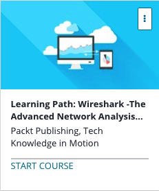

```
Roberto Nogueira  
BSd EE, MSd CE
Solution Integrator Experienced - Certified by Ericsson
```
# Udemy Learning Path Wireshark



**About **

Learn everything you need to about the subject of this `Udemy` project.

[Homepage](https://www.udemy.com/learning-pathwireshark-2-the-advanced-network-analysis-tool/learn/v4/content)

## Topics
```
Section: 1
0 / 25
Network Analysis Using Wireshark 2
[ ] 1. The Course Overview 3:53
[ ] 2. Protocol Analyzers 9:26
[ ] 3. Wireshark – Data Input 11:52
[ ] 4. Wireshark – Initial Settings 12:42
[ ] 5. Wireshark – GUI Interface 9:32
[ ] 6. Protocol Stack – Basics 7:29
[ ] 7. Protocol Stack – Basics (continued) 10:52
[ ] 8. Protocol Stack in Wireshark 10:17
[ ] 9. Display Filters 13:10
[ ] 10. Display Filters (Continued) 13:28
[ ] 11. Display Filters – Final Tuning 7:43
[ ] 12. Capture Filters 12:04
[ ] 13. Wireshark – Display Customizing 18:24
[ ] 14. Saving Traces 11:55
[ ] 15. Splitting/Merging Files 17:54
[ ] 16. Name Resolution 11:48
[ ] 17. Graphical Analysis 9:32
[ ] 18. Related Packets 4:21
[ ] 19. Useful Statistics 8:37
[ ] 20. Useful Statistics (Continued) 8:13
[ ] 21. If Wireshark Doesn't Decode! 6:58
[ ] 22. Troubleshooting Overview 5:46
[ ] 23. Issues with a Particular Service 12:18
[ ] 24. Low Performance 8:47
[ ] 25. Additional Help with Security 8:53

Section: 2
0 / 46
Mastering Wireshark 2
[ ] 26. The Course Overview 1:52
[ ] 27. Installing Wireshark on Windows 3:37
[ ] 28. Installing Wireshark on Mac and Linux 5:07
[ ] 29. What’s New in Wireshark 2? 3:29
[ ] 30. Capturing Traffic 7:50
[ ] 31. Saving and Exporting Packets 7:46
[ ] 32. Annotating and Printing Packets 8:35
[ ] 33. Remote Capture Setup 5:16
[ ] 34. Remote Capture Usage 2:52
[ ] 35. BPF Syntax 4:51
[ ] 36. Capture Filters 3:17
[ ] 37. Display Filters 10:14
[ ] 38. Follow Streams 6:06
[ ] 39. Advanced Filtering 8:43
[ ] 40. Preferences 10:45
[ ] 41. Profiles 5:24
[ ] 42. Colorizing Traffic 9:51
[ ] 43. Colorizing Traffic (Continued) 6:11
[ ] 44. TCP/IP Overview 8:31
[ ] 45. Time Values and Summaries 5:21
[ ] 46. Trace File Statistics 7:49
[ ] 47. Expert System Usage 4:25
[ ] 48. DNS Analysis 9:45
[ ] 49. ARP Analysis 7:14
[ ] 50. IPv4/6 Analysis 7:15
[ ] 51. ICMP Analysis 8:40
[ ] 52. UDP Analysis 5:08
[ ] 53. TCP Analysis I 10:40
[ ] 54. TCP Analysis II 6:22
[ ] 55. Graph I/O Rates and TCP Trends 10:32
[ ] 56. DHCP Analysis 9:40
[ ] 57. HTTP Analysis I 10:26
[ ] 58. HTTP Analysis II 7:06
[ ] 59. FTP Analysis 10:11
[ ] 60. Email Analysis 11:26
[ ] 61. 802.11 Analysis 11:40
[ ] 62. VoIP Analysis 11:42
[ ] 63. VoIP Playback 5:59
[ ] 64. Running Wireshark from Command Line 7:51
[ ] 65. Running Tshark 4:12
[ ] 66. Running tcpdump 6:48
[ ] 67. Running Dumpcap 4:05
[ ] 68. Wireshark Plugins 5:15
[ ] 69. Determining Where to Capture 2:17
[ ] 70. Capturing Scenario Traffic 4:07
[ ] 71. Diagnosing Scenario Traffic 7:23
```
